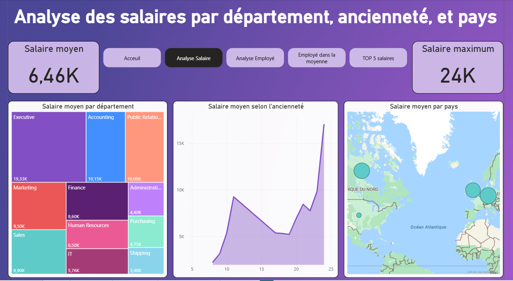
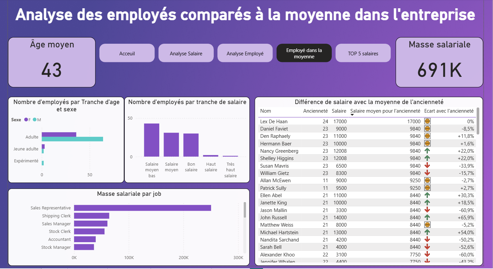

# 👋 Ismaël Faihe

**Étudiant en BUT Science des Données – Spécialisation Data & BI**
IUT2 Grenoble · Visualisation et Conception d'Outils Décisionnels

Je suis passionné par la transformation de données brutes en informations exploitables et utiles à la décision. Ce qui m'attire dans la data, c'est de donner du sens à la donnée — pas juste la traiter, mais comprendre ce qu'elle dit et le communiquer clairement.

Je me destine au **data engineering** et souhaite évoluer dans un environnement international. Enthousiaste, communicant et rigoureux, j'aime autant construire des pipelines de données que présenter des résultats à un public varié.

📅 **Disponible en stage** : dès le 20 avril 2026 (10–12 semaines)
📅 **Disponible en alternance** : à partir de septembre 2026 (12 mois)
📍 Grenoble, France · Ouvert à l'international

---

## 🛠️ Compétences

### Outils Data & BI
| Catégorie | Outils |
|---|---|
| ETL & Intégration | KNIME, MySQL, SQL |
| Visualisation | Power BI, Tableau, R Shiny |
| Langages | Python, R, SQL, PHP, HTML/CSS |
| BDD | MySQL, modélisation en étoile, data warehouse |
| Géospatial | ArcGIS, Survey123 |
| Autres | Excel (VBA, TCD), Jupyter, Git |

### Savoir-faire
- Conception et développement de chaînes décisionnelles (ETL → data warehouse → dashboard)
- Analyse statistique univariée et multivariée (ACM, CAH, ACP)
- Nettoyage, structuration et fiabilisation de données hétérogènes
- Développement d'applications interactives (R Shiny, PHP/MySQL)
- Collecte automatisée via API REST (Python)
- Rédaction de documentation technique et restitution orale

### Qualités
- 🔍 Rigueur et attention au détail
- 💬 Communicant — à l'aise à l'oral comme à l'écrit
- 🌍 Enthousiaste pour les projets internationaux
- 🤝 Esprit d'équipe, habitué aux projets en groupe
- 🚀 Autonome et force de proposition

### Langues
| Langue | Niveau |
|---|---|
| Français | Natif |
| Anglais | B2 – professionnel |
| Italien | B1 |

---

## 🔑 Projets clés

---

### 📊 Business Intelligence – Tableaux de bord RH (Power BI)
Conception de dashboards interactifs sur des données RH d'entreprise : effectifs, répartition géographique, pyramide des âges, masse salariale. Modélisation des données, mesures DAX et déploiement multi-pages.

| Vue effectifs & pays | Vue salaires & répartition |
|---|---|
|  |  |

---

### 🔄 Chaîne décisionnelle ETL – KNIME + MySQL
Développement d'une chaîne décisionnelle complète sous KNIME : intégration de données hétérogènes (CSV, Excel, XML) issues du secteur des transports dans un data warehouse MySQL. Architecture en étoile, nettoyage, transformation et chargement automatisés.

| Flux ETL complet | Détail nœuds de transformation |
|---|---|
|  |  |

---

### 🌐 Mini-site web d'analyse de ventes – PHP/MySQL
Développement d'un site PHP/MySQL analysant les ventes hebdomadaires Walmart. Base en étoile (faits_ventes, dim_magasin, dim_temps), requêtes SQL dynamiques, visualisations Chart.js avec coloration saisonnière et KPIs.

| Page d'accueil | Tableau de bord ventes | Vue détaillée magasin |
|---|---|---|
|  |  |  |  

---

### 🇨🇿 BIP Prague – Data-Driven Decision Making (VŠE, avril 2026)
Collaboration internationale en anglais à l'Université d'Économie de Prague. Simulation de décisions business en environnement incertain, formulation de questions analytiques, modélisation de données et création de tableaux de bord décisionnels sous Power BI.

| Campus VŠE Prague | Sur place |
|---|---|
|  |  |

---

## 📁 Autres projets

---

### 🧩 Scraping & Catalogue web – API Rebrickable (Python)
Extraction automatisée via l'API REST Rebrickable (25 000+ sets Lego). Génération d'un catalogue HTML interactif filtrable par thème et année, avec redirection vers les fiches produits. Architecture modulaire en 3 fichiers Python.

---

### 📈 Analyse de données & Application interactive – R Shiny
Analyse d'une enquête de 4 000 répondants (UGA) sur l'usage des outils d'IA générative. Nettoyage, ACM et CAH sous R/FactoMineR, segmentation en 4 profils, restitution via une application R Shiny interactive.

---

### 🗺️ BI & SIG – Inventaire de signalisation UGA (ArcGIS)
Inventaire terrain des traversées de tramway sur le campus UGA pour la DGD PAT. Collecte via Survey123, calcul de coûts via Arcade/SQL, livraison d'un Dashboard et d'une StoryMap ArcGIS pour un client réel.

---

### 📉 Étude statistique – Syndicalisation secteur médico-social (DARES)
Analyse statistique d'un jeu de données sur la syndicalisation avec RStudio. Nettoyage, statistiques descriptives, visualisations et présentation orale des résultats sous Tableau.

---

## 📬 Contact

[LinkedIn](https://linkedin.com/in/ismael-faihe) · ifaihe@proton.me · +33 7 68 57 34 17
